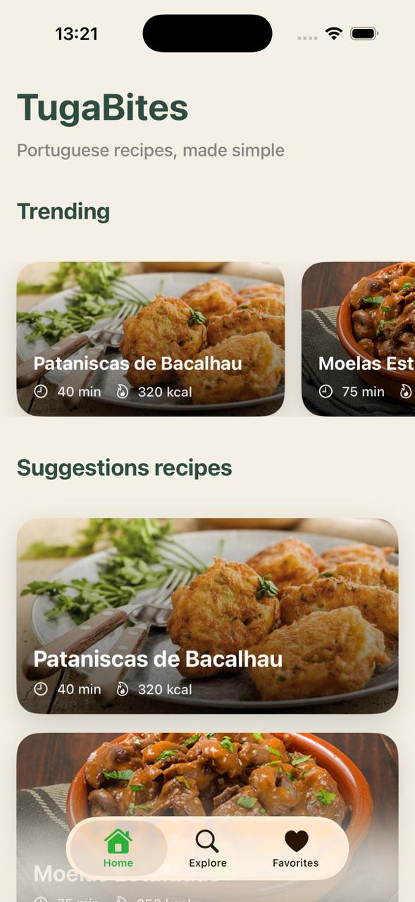
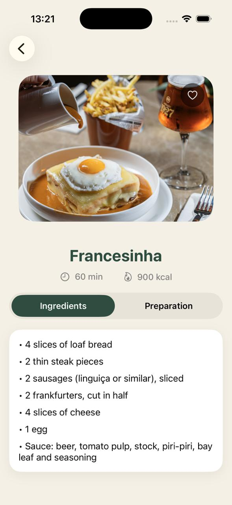
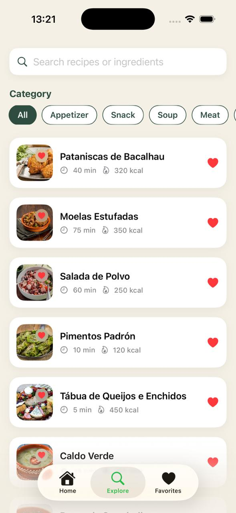
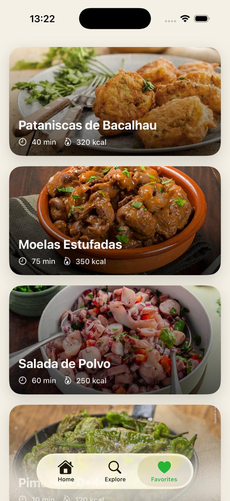

# TugaBites – iOS Application Report

## 1. Introduction

This report presents **TugaBites**, an iOS mobile application developed using **SwiftUI**.  
The application focuses on promoting traditional Portuguese cuisine through a modern, intuitive, and visually appealing mobile experience.

TugaBites allows users to explore a curated collection of Portuguese recipes, search by name or ingredients, filter by category, and save favourite recipes for quick access. The application was designed with a strong emphasis on **usability**, **clean architecture**, and **user experience**, following best practices for modern iOS development.

This application was developed by **Gonçalo Vale (student number 293996)** and **Francisco Silva (student number 294008)**, within the scope of the curricular unit **Mobile Applications for iOS**, taught at **Wrocław University of Science and Technology (Politechnika Wrocławska)**.

This document describes the purpose of the application, its structure, the main functionalities implemented, and the logic behind key technical decisions.

---

## 2. Application Objectives

The main objectives of the **TugaBites** application are:

- **Provide access to traditional Portuguese recipes**  
  The application offers a curated collection of traditional Portuguese recipes, presenting them in a clear and structured way. Each recipe includes essential details such as preparation time, calorie count, ingredients, and preparation steps, ensuring the information is useful and easy to understand.

- **Enable intuitive searching by recipe name or ingredients**  
  TugaBites allows users to search using a single search field that supports both recipe names and ingredients. This design choice simplifies the search process and improves usability by reducing unnecessary complexity.

- **Allow filtering of recipes by category**  
  Users can filter recipes by predefined categories, making it easier to browse content according to personal preferences. The category filter helps narrow down results and enhances content discovery.

- **Support saving and managing favourite recipes**  
  The application enables users to mark recipes as favourites and access them later through a dedicated favourites section. This feature personalizes the experience and increases user engagement.

- **Deliver a smooth and pleasant user experience**  
  The interface was designed with simplicity and clarity in mind, using clean layouts, consistent colours, and subtle animations. Interactive elements, such as animated favourite actions, provide visual feedback and make the application feel responsive and modern.

- **Apply a clear and maintainable project structure**  
  From a technical perspective, the application follows best practices for iOS development. SwiftUI is used for the user interface, and the MVVM (Model–View–ViewModel) architectural pattern is applied to ensure separation of concerns, readability, and easier future maintenance.

---

## 3. Application Overview

TugaBites is a **fully offline iOS application**, using local JSON data as its recipe source.  
All data is loaded locally, ensuring fast performance and independence from external services.

The application is composed of three main sections, accessible through a tab-based navigation:

### Home
Highlights trending and suggested recipes.

### Recipe Details
Displays detailed information about a selected recipe.

### Search
Allows searching and filtering recipes by multiple criteria.

### Favorites
Displays recipes saved by the user.

---

Each recipe contains:
- Name  
- Image  
- Preparation time  
- Calorie information  
- Ingredients list  
- Preparation steps

---

## 4. Technologies and Tools Used

The **TugaBites** application was developed using the following technologies and tools:

- **Swift**  
  The main programming language used for the entire application logic, data handling, and state management. Swift was chosen for its safety, performance, and seamless integration with the iOS ecosystem.

- **SwiftUI**  
  Used as the primary user interface framework. SwiftUI enables a declarative approach to UI development, allowing the interface to react automatically to state changes. It was used to build all screens, layouts, animations, and navigation flows.

- **MVVM (Model–View–ViewModel)**  
  The architectural pattern adopted to structure the project. MVVM ensures a clear separation between data models, business logic, and user interface, improving code readability, testability, and maintainability.

- **Combine**  
  Used to manage reactive data flow between repositories, view models, and views. Combine publishers were applied to automatically update the UI when data changes, particularly for recipe loading and favourites management.

- **JSON**  
  Recipe data is stored locally in a JSON file and loaded at runtime. This approach allows structured, scalable, and easily editable data storage, simplifying content management and validation during development.

- **UserDefaults**  
  Used for lightweight local persistence, specifically to store and retrieve favourite recipe identifiers. This ensures that user preferences remain available between application launches.

- **Assets Catalog (Images)**  
  Recipe images and visual resources are managed through the iOS Assets catalog, allowing efficient image loading and proper scaling across different device sizes.

- **Xcode**  
  The main development environment used to build, test, and debug the application. Xcode provides integration with iOS simulators, asset management, and performance tools.

- **macOS Development Environment**  
  The application was developed and tested on macOS, which is required for native iOS development and Xcode usage.

- **Markdown**  
  Used to create clear and structured technical documentation, allowing easy formatting and readability of the project report.

---

## 5. Project Structure (MVVM)

The **TugaBites** project follows a clear and modular folder structure, based on the **MVVM (Model–View–ViewModel)** architectural pattern.  
This structure makes the code easier to understand, maintain, and extend, while keeping responsibilities separated.

### 5.1 Folder Structure Overview

Below is a simplified diagram representing the current project organization:

TugaBites1fl/
├── Assets.xcassets
├── Data/
│ ├── FavoritesStore.swift
│ └── RecipeRepository.swift
├── Models/
│ ├── Category.swift
│ └── Recipe.swift
├── Resources/
│ └── recipes.json
├── ViewModels/
│ ├── FavoritesViewModel.swift
│ └── SearchViewModel.swift
├── Views/
│ ├── Components/
│ │ └── RecipeRow.swift
│ ├── FavoritesView.swift
│ ├── HomeRecipeCard.swift
│ ├── HomeView.swift
│ ├── RecipeDetailView.swift
│ ├── RootTabView.swift
│ └── SearchView.swift
├── Report_Tugabites/
│ ├── images/
│ └── report.md
└── TugaBites1_App.swift

 
### 5.2 MVVM Architecture Used

The application is built using **MVVM**, which stands for:

- **Model** – represents the data structures of the app  
- **View** – represents the UI (what the user sees)  
- **ViewModel** – contains the logic that connects the data to the UI

The key idea is:  
✅ **Views stay focused on UI**, while ✅ **ViewModels handle state and logic**, and ✅ **Models represent structured data**.

### 5.3 How MVVM is Applied in TugaBites

- **Models (`Models/`)**
  - `Recipe.swift` and `Category.swift` define the data used across the app.
  - These models are decoded from the JSON file and then displayed in the interface.

- **Data Layer (`Data/` + `Resources/`)**
  - `recipes.json` stores all recipe content locally.
  - `RecipeRepository.swift` is responsible for loading and validating recipes from JSON.
  - `FavoritesStore.swift` manages favourite recipes (stored as IDs) using `UserDefaults`.

- **ViewModels (`ViewModels/`)**
  - Each main screen has a dedicated ViewModel:
    - `SearchViewModel` manages searching and filtering logic.
    - `FavoritesViewModel` computes the list of favourite recipes based on stored IDs.
  - ViewModels expose clean properties like `filteredRecipes`, `items`, etc., so the UI can react automatically.

- **Views (`Views/`)**
  - Views present the interface and react to state changes.
  - Each view focuses only on layout, navigation, and interaction.
  - Reusable UI components are placed inside `Views/Components/` (e.g., `RecipeRow`).

### 5.4 Why MVVM Was the Best Choice for This Project

MVVM is especially suitable for **SwiftUI** projects because SwiftUI is state-driven: whenever the state changes, the UI updates automatically. MVVM supports this workflow naturally.

MVVM was chosen for TugaBites because it:

- **Separates responsibilities clearly**
  - UI code is not mixed with filtering/persistence logic.

- **Improves maintainability**
  - Each screen has its own logic in its ViewModel, making changes safer and easier.

- **Makes the app easier to scale**
  - Adding features (e.g., sorting, offline caching, recipe ratings) becomes simpler because logic is already separated.

- **Works well with Combine**
  - Reactive flows (such as favourites updating the UI) are straightforward and clean.

### 5.5 Summary

Overall, the project structure and MVVM architecture ensure that:

- data loading and persistence are kept in the **Data layer**
- recipe structures are defined in the **Models**
- screen logic lives in **ViewModels**
- interface is implemented in **Views**, with reusable UI components separated clearly

This organization results in a project that is clean, readable, and well-prepared for future improvements.

---

## 6. Code Explanation by Sections

This chapter explains the purpose of each main folder in the project and describes what each file does and how it works.  
The goal is to clearly present the logic and responsibilities of the code, following the MVVM structure.

---

## 6.1 Data Layer (`Data/`)

### Purpose of this folder
The `Data` folder contains the **data access and persistence layer** of the application.  
It is responsible for:
- loading the recipes into the app (local data source)
- validating and providing recipe data to the UI
- managing user-specific stored data (favourites)

Keeping this logic outside the Views avoids mixing UI code with data/persistence responsibilities.

### Files in this folder

#### `RecipeRepository.swift`
**What it does**
- Loads the recipes from `recipes.json` (inside `Resources/`)
- Decodes the JSON into `[Recipe]`
- Performs basic validation (e.g., empty names, missing images, invalid values)
- Publishes the final recipe list so the UI can react automatically

**How it works**
- Uses `Bundle.main.url(...)` to locate `recipes.json`
- Loads the file data using `Data(contentsOf:)`
- Decodes it using `JSONDecoder().decode([Recipe].self, from: data)`
- Runs a validation method (`validateRecipe`) for each recipe
- Updates `@Published private(set) var recipes: [Recipe]`, which triggers SwiftUI updates

**Why it matters**
This file acts as the **single source of truth** for recipe data in the app.

---

#### `FavoritesStore.swift`
**What it does**
- Stores and manages favourites locally using `UserDefaults`
- Saves only recipe IDs (not full recipe objects) for simplicity and efficiency
- Provides methods for toggling and checking favourites

**How it works**
- Keeps a set of favourite IDs:
  - `@Published private(set) var favoriteIDs: Set<Int>`
- On init, it loads saved IDs from `UserDefaults`
- When toggling a recipe:
  - if it exists → removes the ID
  - if it does not exist → inserts the ID
- After changes, it saves the updated set back to `UserDefaults`

**Why it matters**
This store allows the app to remember favourites between sessions, without any backend or login system.

---

## 6.2 Models (`Models/`)

### Purpose of this folder
The `Models` folder contains the **data structures** used throughout the application.  
These models represent the real “entities” of the app, such as recipes and categories.

Models are:
- independent from UI
- used by repositories, viewmodels, and views
- decoded directly from JSON

### Files in this folder

#### `Recipe.swift`
**What it does**
- Defines the structure of a recipe in the application

**Key fields**
- `id` – unique identifier
- `name` – recipe title
- `imageName` – name of the image stored in assets
- `category` – recipe category (enum)
- `prepTimeMinutes` – preparation time
- `calories` – kcal value
- `ingredients` – list of ingredients
- `steps` – preparation steps

**How it works**
- Conforms to:
  - `Codable` (JSON decoding)
  - `Identifiable` (used directly in SwiftUI lists)
  - `Hashable` (useful for navigation and data comparison)

---

#### `Category.swift`
**What it does**
- Defines the available recipe categories (e.g., Meat, Soup, Snack, etc.)

**How it works**
- Implemented as an `enum`
- Typically conforms to:
  - `CaseIterable` (so the UI can list all categories automatically)
  - `Identifiable` or `Hashable` (so it can be used in `ForEach`)

**Why it matters**
Categories power the filtering system and keep the UI consistent.

---

## 6.3 ViewModels (`ViewModels/`)

### Purpose of this folder
The `ViewModels` folder contains the logic and state management for each screen.  
A ViewModel:
- receives data from repositories/stores
- processes it (filtering, searching, transforming)
- exposes clean properties for the UI to display
- keeps Views “UI-only” with minimal logic

### Files in this folder

#### `SearchViewModel.swift`
**What it does**
- Handles the search input and category filtering logic
- Produces `filteredRecipes` which updates automatically in the UI

**How it works**
- Keeps:
  - `searchQuery` (single search bar)
  - `selectedCategory`
  - internal list `allRecipes`
- `applyFilters()` filters recipes by:
  - category (if selected)
  - query match (recipe name OR any ingredient)

---

#### `FavoritesViewModel.swift`
**What it does**
- Produces a list of the user’s favourite recipes

**How it works**
- Combines:
  - the repository list of recipes
  - the `FavoritesStore` favourite IDs
- Uses `CombineLatest` to react to changes from both sources
- Filters recipes whose IDs exist in `favoriteIDs`
- Publishes the final list as `items`

---

## 6.4 Views (`Views/`)

### Purpose of this folder
The `Views` folder contains all SwiftUI screens and reusable UI components.

Views are responsible for:
- layout and UI styling
- navigation (NavigationLink)
- user interaction (buttons, taps)
- presenting the state coming from ViewModels and Stores

### Main screens

#### `HomeView.swift`
- Landing page of the app
- Shows:
  - header branding
  - trending horizontal section
  - suggestions vertical list
- Uses `HomeRecipeCard` for display

---

#### `SearchView.swift`
- Search page with:
  - one search bar
  - category chips
  - filtered results list
- Uses `SearchViewModel` for the filtering logic
- Uses `RecipeRow` for each result row

---

#### `FavoritesView.swift`
- Displays only the user’s favourites
- Derives favourite recipes using `repo.recipes` + `favorites.favoriteIDs`
- Shows empty state message if none exist
- Uses `HomeRecipeCard` for a consistent UI

---

#### `RecipeDetailView.swift`
- Displays a selected recipe in detail
- Shows:
  - hero image with favourite toggle
  - recipe title and metrics
  - tab switch between ingredients and preparation
- Uses reusable card styling (`sectionCard`) for visual consistency

---

#### `RootTabView.swift`
- Main navigation structure
- Provides the tab bar with:
  - Home
  - Explore/Search
  - Favorites

---

### Components (`Views/Components/`)

#### `RecipeRow.swift`
- Reusable row used in search results
- Displays:
  - image thumbnail
  - name and metrics
  - favourite button
- Includes the favourite button animation feedback

---

## 6.5 Summary

The project is organized so that:
- **Data** loads and stores information
- **Models** represent the app entities
- **ViewModels** contain logic and state
- **Views** focus on UI and interaction

This separation improves clarity, maintainability, and makes the app easier to evolve.

---

## 7. User Interface and Navigation Flow

The **TugaBites** user interface was designed with **simplicity, clarity, and consistency** as primary goals.  
The application follows standard **iOS design conventions**, allowing users to navigate intuitively without requiring prior instructions.

### 7.1 Tab-Based Navigation

The main navigation is implemented using a **tab bar**, providing direct access to the three core sections of the application:

- **Home** – Displays featured and suggested recipes  
- **Search** – Allows users to search and filter recipes  
- **Favorites** – Shows all recipes marked as favourites by the user  

This navigation structure ensures that the most important features are always reachable with a **single tap**.

### 7.2 Navigation Flow

Navigation between screens is handled using `NavigationStack` and `NavigationLink`.

- Selecting a recipe from any list (**Home**, **Search**, or **Favorites**) navigates the user to the **Recipe Detail** screen.
- This approach guarantees a **consistent navigation experience** across all sections of the app.

### 7.3 Visual Consistency and Layout

- A consistent **colour palette** and **spacing** are used across all screens.
- Content is displayed using **card-based layouts**, improving readability and visual hierarchy.
- Reusable UI components, such as `HomeRecipeCard` and `RecipeRow`, ensure uniform presentation and reduce code duplication.

Overall, the UI design aims to be **minimalistic yet visually engaging**, allowing users to focus on content rather than interface complexity.

---

## 8. Key Functionalities

The **TugaBites** application implements several core functionalities that together provide a complete and user-friendly experience.

### 8.1 Recipe Browsing

- Recipes are loaded locally from a **JSON file**.
- Content is displayed across multiple sections.
- The **Home** screen highlights trending and suggested recipes, encouraging content discovery.

### 8.2 Search and Filtering

- A single search field allows users to search by **recipe name or ingredients**.
- Recipes can be filtered by **category** using horizontal filter chips.
- Search and filtering work together seamlessly, updating results **in real time**.

### 8.3 Favorites Management

- Users can mark recipes as favourites using a **heart icon**.
- Favourite recipes are stored locally and **persist between application launches**.
- A dedicated **Favorites** screen provides quick access to saved recipes.

### 8.4 Recipe Detail View

Each recipe includes a detailed view displaying:

- Hero image  
- Preparation time and calories  
- Ingredients list  
- Step-by-step preparation instructions  

Content is organised using **tabs** to avoid overwhelming the user with information.

All functionalities were implemented with **usability in mind**, ensuring interactions are simple, fast, and predictable.

---

## 9. Animations and User Experience

Animations were intentionally kept **subtle and meaningful**, enhancing user experience without distracting from the content.

### 9.1 Favorite Animation

- When a recipe is added to favourites, a **heart icon** appears with a smooth animation.
- The animation provides **immediate visual feedback**, confirming the user’s action.
- The heart remains visible while the recipe is marked as favourite and disappears only when it is removed.

### 9.2 Interactive Feedback

- Buttons and interactive elements include lightweight animations (such as symbol effects and transitions).
- Tab switching and content changes are animated to create **smooth transitions** between sections.

### 9.3 UX Design Principles

- Animations are used only when they **improve clarity or feedback**.
- No animation blocks or delays user interaction.
- The overall experience feels **modern and fluid**, aligned with current iOS design standards.

These decisions contribute to a **polished and professional feel**, improving both usability and perceived quality.

---

## 10. Conclusion

The **TugaBites** application successfully meets its initial objectives by providing a **clean, intuitive, and visually appealing** platform for exploring traditional Portuguese recipes.

By using **SwiftUI** and the **MVVM architecture**, the project demonstrates a clear separation of concerns, resulting in a codebase that is easy to understand, maintain, and extend. The integration of **local JSON data**, **reactive state management**, and **persistent favourites** enables a fully functional **offline application**.

The project also highlights the importance of **user experience**, combining clean interface design with subtle animations to deliver a modern and engaging mobile app.

Overall, **TugaBites** serves as a solid example of a well-structured iOS application built with **modern technologies and best practices**, while leaving room for future improvements and feature expansion.
